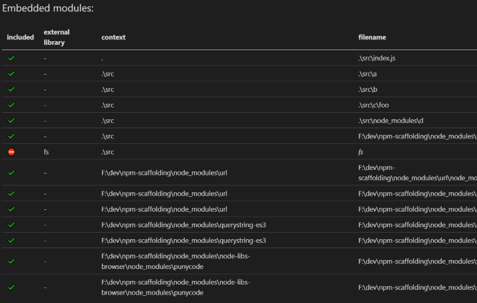

# Webpack Externals Manager
Extends the original webpack 4 externals management, to deals with what should be bundled or not.

## Install
```bash
npm i webpack-externals-mngt -D
```

## Brief
This modules extends the original webpack *externals* feature, with a list of rules to allow a fine tune management.

example of logs output:



> requiered skill: You need to understand, how [Webpack treats externals](https://webpack.js.org/configuration/externals/) treats natively *externals*

# Examples
`webpack.config.js`:
```js

// [...]

externals: [
    new ExternalsMngt.Manager({
        rules: [
            /* Examples */
            {
                // all builtin (such as 'fs') becomes
                // <root> library ("fs" => "fs")
                test: ExternalsMngt.is.builtIn(),
                target: ExternalsMngt.lib.root()
            },
            {
                // this specific builtin (path) becomes
                // <root> library ("path" => "myPath")
                test: ExternalsMngt.is.builtIn("path") 
                target: ExternalsMngt.lib.root("myPath")
            },
            {
                // this specific node modules (moment) becomes
                // commonjs library ( => "commonjs myMoment")
                test: ExternalsMngt.is.nodeModule("moment"),
                target: ExternalsMngt.lib.commonjs("myMoment")
            },
            {
                // Node module witch starts with "dev." becomes
                // commonjs library
                test: /node_modules\/dev.*/),
                target: ExternalsMngt.lib.commonjs()
            }
        ],
        
        /* optionals */

        /** Root Directory (where './node_modules/' is) */
        rootDir: ".", // default
        /** Path to 'tsconfig.json' (used to know alias) */
        tsconfigPath: "./tsconfig.json", // default null
        /** log file (without extension), if defined it will be a .md markdown file*/
        summaryFile: './dist/bundle', // default value null
     }
]

// [...]

```

# How does it work ?
Each rule is composed of:
- a **TEST**, which returns true if the module should be exclude from the bundle (*external*)
- a **TARGET**, to define how the *external* should be used (*commonjs? root?*)

For each *required()* modules, all rules are tested/applied (from first to last) 

Hence you can define general cases at the really beginning, and then, in the lastest rules, you may defines some specifics situations

## TEST
The test is applied on requested module **filename** (which is an absolute path based on rootDir)

>
> ⚠️note⚠️:
>
> If module filename can not be resolved as an absolute path, then, filename is set to the original webpack-request.
> That means that the module is:
> - a 'npm --global' module
> - or a native module (such as 'fs', 'path' and such)
>
> **isBuiltIn** flag will be set to true
>

The test can be
- a string: It will returns true if there is an exact match with requested module **filename** (absolute based on rootDir)
- a regex: same as string but with regex instead of exact match
- a function(context, request), where

```ts
     context: {
         options: object // Manager options used
         ruleIndex: number // Current rule index in options.rules[]
         target: string // Current target applied (set by previous rules)
         webpackContext: string // Current webpack original context
     }
     request: {
         filename: string: // Absolute module filename (or webpackRequest if isBuiltin is set to true)
         isBuiltIn: boolean // True, if module filename can not be resolved (such as 'fs', 'path' and such)
         webpackRequest: string // Current webpack original request
     }
```
Examples
```js
// return true, if webpack request is a builtIn/global module
const isBuiltIn(context, request) => request.isBuiltIn

// return true, if webpack request is a specific node_modules package (moduleName)
function isNodeModule(moduleName = "") {
    return function(context, request) {
        if (request.isBuiltIn) return false
        const base = path.resolve(context.options.rootDir, "node_modules", moduleName)
        return request.filename.startWith(base)
    }
}
```

## TARGET
Target defined how the external module will be used, typically webpack 4 supports the following library:
- **commonjs**: The library should be available as a CommonJS module.
- **commonjs2**: Similar to the above but where the export is module.exports.default.
- **amd**: Similar to commonjs but using AMD module system.
- **\<root\>**: The library should be available as a global variable

target can be:
- a string
- a function(context, request)

Examples
```js
// return a <root> library where the root is actually the filename basename
function basename(context, request) {
    context.target = path.basename(request.filename)
}

// set a specific string
function rename(value) {
    return function(context, request) {
        context.target = value
    }
}
// or merely...
const rename = (value) => (context, request) => context.target = value
```
